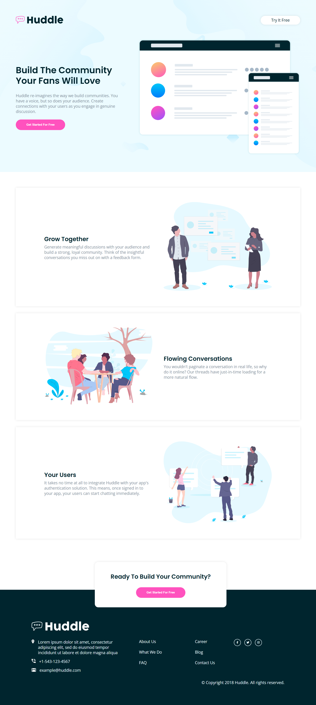
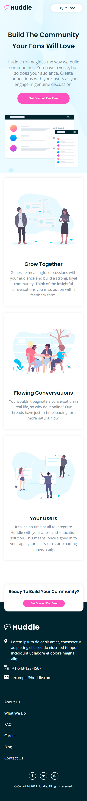

# Frontend Mentor - Huddle landing page with alternating feature blocks solution

This is a solution to the [Huddle landing page with alternating feature blocks challenge on Frontend Mentor](https://www.frontendmentor.io/challenges/huddle-landing-page-with-alternating-feature-blocks-5ca5f5981e82137ec91a5100). Frontend Mentor challenges help you improve your coding skills by building realistic projects.

## Table of contents

- [The challenge](#the-challenge)
- [Screenshot](#screenshot)
- [Links](#links)

- [Built with](#built-with)

- [Author](#author)
- [Acknowledgments](#acknowledgments)

### The challenge

Users should be able to:

- View the optimal layout depending on their device's screen size
- See hover and focus states for interactive elements

### Screenshot

 

### Built with

- Semantic HTML5 markup
- CSS custom properties
- Flexbox
- Grid

## Author

- Website - [Sirajul Islam](https://www.sistech95.netlify.com)
- Frontend Mentor - [@sirajshaon](https://www.frontendmentor.io/profile/sirajshaon)
- Twitter - [@sisirajshaon](https://www.twitter.com/sisirajshaon)

## Acknowledgments

I would like to thank [ProcoderBD](https://procoderacademy.com) for his tutorials.
