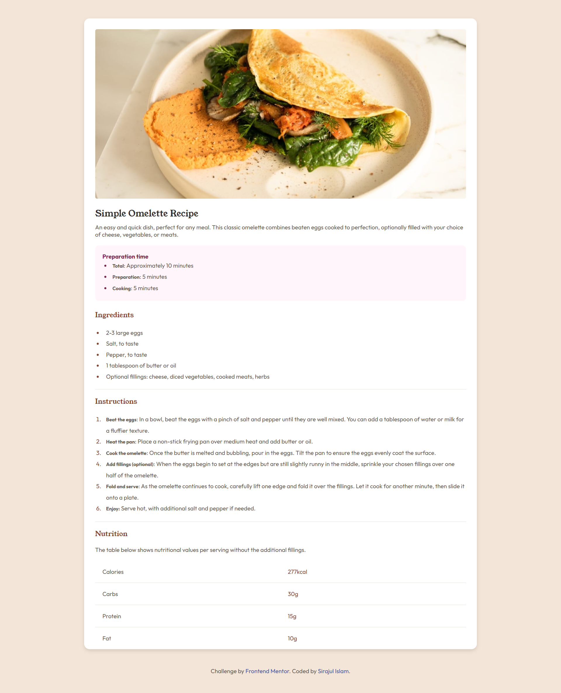
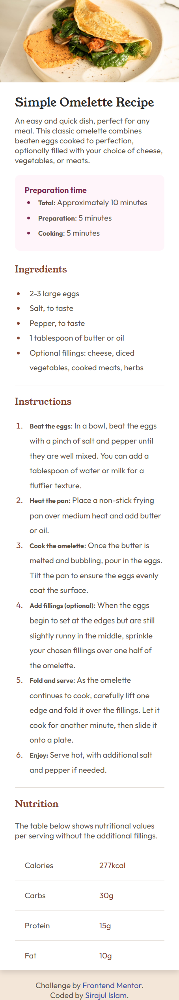

# Frontend Mentor - Recipe page solution

This is a solution to the [Recipe page challenge on Frontend Mentor](https://www.frontendmentor.io/challenges/recipe-page-KiTsR8QQKm). Frontend Mentor challenges help you improve your coding skills by building realistic projects.

## Table of contents

- [The challenge](#the-challenge)
- [Screenshot](#screenshot)
- [Links](#links)

- [Built with](#built-with)

- [Author](#author)
- [Acknowledgments](#acknowledgments)

### Screenshot

### Links

- Solution URL: [Add solution URL here](https://your-solution-url.com)
- Live Site URL: [Add live site URL here](https://your-live-site-url.com)

### Built with

- Semantic HTML5 markup
- CSS custom properties
-

## Author

- Website - [Sirajul Islam](https://www.sistech95.netlify.com)
- Frontend Mentor - [@sirajshaon](https://www.frontendmentor.io/profile/sirajshaon)
- Twitter - [@sisirajshaon](https://www.twitter.com/sisirajshaon)

## Acknowledgments

I would like to thank ProcoderBD for his tutorials.
